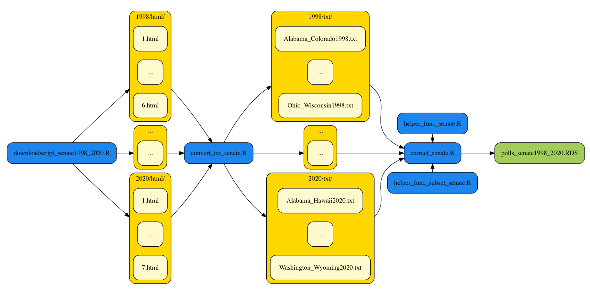

### Code for scraping US Senate polls 

Running the code will create a data frame with polling results for US Senate elections from 1998 to 2020 available on [pollingreport.us](https://www.pollingreport.us). A subscription to [pollingreport.us](https://www.pollingreport.us) is required. Save your username and password in "usr_pwd.txt" (username:password). 

First you need to run the [downloadscript_senate1998_2020.R](https://github.com/SinaMaria412/predictors_of_polling_errors/blob/master/us_senate/scrape/downloadscript_senate1998_2020.R). The websites with senate polling results from 1998 to 2020 will be downloaded and stored separately for every year and state/group of states as html files. The folder structure is year/html/. In a next step, to convert these html files to txt for further processing run the [convert_txt_senate.R](https://github.com/SinaMaria412/predictors_of_polling_errors/blob/master/us_senate/scrape/convert_txt_senate.R) script. Running this script will create the sub folder "txt" within every year folder (year/txt/) with one txt file per state. To extract the relevant information and combine all in one data frame run [extract_senate.R](https://github.com/SinaMaria412/predictors_of_polling_errors/blob/master/us_senate/scrape/extract_senate.R). The files [helper_func_senate.R](https://github.com/SinaMaria412/predictors_of_polling_errors/blob/master/us_senate/scrape/helper_func_senate.R) and [helper_func_subset_senate.R](https://github.com/SinaMaria412/predictors_of_polling_errors/blob/master/us_senate/scrape/helper_func_subset_senate.R) include necessary functions to extract relevant information from the txt files and arrange this information in a data frame.

The complete workflow is summarised in the figure below. 

- Yellow boxes: raw input data
- Blue boxes: R script to transform data
- Green boxes: intermediate and final data sets

The created data frame includes information on:

- election_year: year, election took place
- date: last date of field period
- pollFirm: name of polling firm
- n: sample size (if reported)
- respondents: reported respondents, unformated
- rep_candidate: reported name of Dem. candidate (if reported)
- dem_candidate: reported name of Rep. candidate (if reported)
- rep_poll: Rep. poll vote share (if reported)
- dem_poll: Dem. poll vote share (if reported)
- green_candidate: reported name of Green candidate (if reported)
- green_vote: Green poll vote share (if reported)
- lib_candidate: reported name of Lib. candidate (if reported)
- lib_vote: Lib. poll vote share (if reported)
- reform_candidate: reported name of Reform candidate (if reported)
- reform_vote: Reform poll vote share (if reported)
- ind_candidate: reported name of Ind. candidate (if reported)
- ind_vote: Ind. poll vote share (if reported)
- write_in_candidate: reported name of write-in candidate (if reported)
- write_in_vote: Write-in candidate poll vote share (if reported)
- undecided: share of respondents answering being undecided (if reported)
- refused: share of poll refusals (if reported)
- other: share of other poll responses (if reported)
- MoE: reported margin of error
- states_long: full state name

